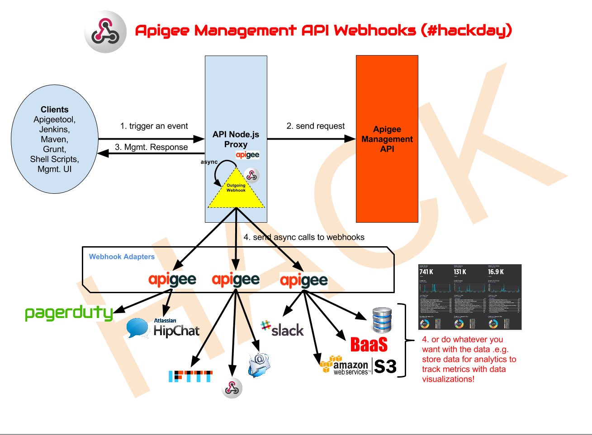
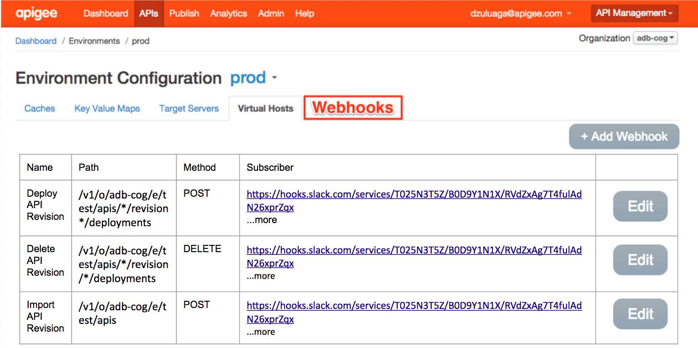

Why do we need Apigee API Management Webhooks?
=========

The use case for Webhooks in Apigee is simple. As an API consumer I want to get a notification of an action happening on my API Platform, so that I know when something changes from one state to another in real time. For instance: I want to be notified when a KVM, Vault, Target Server, API Proxy, RBAC role, or even an SSL certificate was modified in my PROD environment.

This is not the API way! Apigee Management Webhooks to the rescue!



#### How can I implement this model?
Source: | https://drive.google.com/open?id=1KjRj1rc6GrkBkf2FbpH81FxHuWxitPT_gxcEwWcflaM
--------|-----------------------------

**Source code:**

|                             |                                                          |
|---------------------------- | -------------------------------------------------------- |
| *Management API Proxy/Facade* | https://github.com/apigee-webhooks/management-api-facade |
| *Adapter*                     | https://github.com/apigee-webhooks/slack-webhooks-adapter|


#### How can we augment the Management APIs or any API?

Currently we don’t have a way to get notified when any of my Apigee components in my API Platform changes. Except through a long polling process to audit logs API, which requires to run a job on a schedule basis. This is simply too much work, in order to implement it that way, I need a way to run a task that runs comparisons against previous data.

**Required**

- adapter layer: in spirit of microservices architecture 
- gateway layer: calls the MS API and calls the adapter layer
- README: including disclaimer that this solution introduces gateway infrastructure as part of the MS API calls.  This adds - a point of failure to the API call chain, so “use at your own risk”.

** Northbound: From Consumer App to Facade/Proxy API **
Exact as the Management API, since facade API is a passthrough.  

**Southbound: Adapter Contract - From Proxy API to Webhook Adapter**
**Configuration:**
1. JSON file that contains which adapters for a given profile


| Verb + Resource 					| Payload | Request Headers |
| --------------------------------- | ------- | --------------- |
| POST https://v1/slack-webhook/	| ```{ "response": "management_api_response", "responseCode": "200", "resource": "resource_url", "verb": "POST" }``` |
| key:12345 (hardcoded) or basic auth. |

**Example:** https://docs.google.com/document/d/1BUGbp9c2AxjtQpZkeYl4Vtp4pmB6ATFDnYCz15hOYAk/edit

Verb + Resource
Payload
Request Headers
POST https://{anyresource}
{
   content: {management_api_response}
}
key:12345 (hardcoded) or basic auth.

Team Collaboration usecase

#### Nice-to-haves
- User profiles for facade layer
- File upload handling in facade layer.
- security on adapter layer.
- 1-click Yeoman installation.
- Adapter configuration that maps response from MS API to a specific message in the adapter output (e.g., successful API deployment = ‘Successfully deployed API’).
- Abstraction of adapter so that a user of the adapter layer does not need to even know the URL. E.g., they can call a single adapter endpoint that accepts 2 data:  adapter name, payload.
- Extension to administer profiles and associated adapters
- Apigee Sense: trigger events for suspicious activity on Apigee Management API. Set triggers/events based on Thresholds/Counters.
- Apigee BaaS: Store hooks on BaaS instead of retrieving them from JSON files.
- Apigee KVM: Store hooks in KVM instead of retrieving them from JSON files.
- Maven e2e demo.
- Grunt API Deployment in action.
- Send notification to multiple media like HipChat, Slack, PagerDuty, etc. from terminal (calling adapter layer directly).
- IoT integration for a more visual notification.
- Real-time collaboration to approve deployments with Continuous Delivery and Deployment. Similar to Slack automation Your New Digital Worker
- Extend API Proxy Management Facade to provide other methods of authentication besides Basic auth. E.g. password grant. So other apps can login and obtain an refresh tokens.
- Provide a login web app, so that users can login and grant access to third party apps. The user will authenticate with the management API and the login app will return an access and refresh token to the third-part app.


#### Sample API Calls
- Slack
- PagerDuty
- Email

#### How to register to Mgmt. Webhooks through Apigee UI?



#### Caveats
Internal and External hosts for security. So API Mgmt. API Adapters cannot be called externally.

#### Disclaimer
This an API Proxy built as an open source project after a hackday. As such there are no guarantees that the code herein runs without defect. What we want to provide is an out-of-the-box webhook notification solution. This will enable API teams who work in offline development mode with a quick, low-friction and low-cost alternative in the meantime an official Webhook solution is provided. Enabling the product to evolve based on a proof-of-concept first approach.